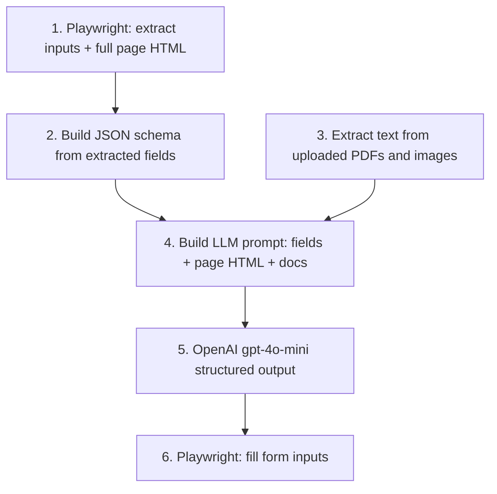

# Document-to-Webform Autofill Implementation Plan

> **For agentic workers:** REQUIRED SUB-SKILL: Use superpowers:subagent-driven-development (recommended) or superpowers:executing-plans to implement this plan task-by-task. Steps use checkbox (`- [ ]`) syntax for tracking.

**Goal:** Upload passport images and G-28 PDFs via a Next.js home page, dynamically discover what fields a target web form needs, extract matching data from documents with OpenAI `gpt-4o-mini`, and autofill the form with Playwright.

**Architecture:** Work backwards from the web form. On each request, Playwright visits `FORM_URL`, scrapes every labeled input (`name`, `type`, `label`) and captures the entire page HTML as a string — no hardcoded field lists. The extracted schema drives the structured output the LLM must return. The full page HTML provides additional context the input scraper alone misses: section headers (e.g. "Name of Attorney or Representative"), agreement/consent text, and notes between fields. Document text (acroform / OCR) and image vision input are combined with the form schema and page HTML in a single prompt. Playwright then fills the form using the LLM's structured output. The form URL is a constant so the same pipeline works on other web forms by changing one config value.

**Tech Stack:** FastAPI, Playwright (Python), OpenAI SDK (`gpt-4o-mini`), pytesseract, pypdf, pdf2image, Pillow, Next.js 16, Tailwind v4

**No git commits** — all changes left uncommitted for user review.

---

## Pipeline Steps (work backwards)

These are the ordered steps the orchestrator runs on every `POST /autofill`:

1. **Extract web form inputs + page HTML** — Playwright opens `FORM_URL`, scrapes all `input`/`select`/`textarea` elements with their `name`, `type`, and associated `label` text, and captures the entire page HTML via `page.content()`
2. **Build structured output schema** — `form_schema.py` converts extracted fields into a JSON schema and prompt text (via f-string interpolation)
3. **Extract document content** — PDFs: try acroform fields, then text extraction, then OCR (`pytesseract` + `pdf2image`). Images: OCR text + base64 for vision input
4. **Build LLM prompt** — `prompts.py` interpolates form field descriptions + full page HTML + extracted document text into one prompt
5. **Run OpenAI** — `openai_client.py` calls `gpt-4o-mini` with structured output + image attachments, returns field values keyed by input `name`
6. **Fill web form** — Playwright opens `FORM_URL` again and fills each input by `name` using the structured output



---

## File Structure

```
fastapi/
├── config.py                          # MODIFY: FORM_URL constant, playwright_headful, openai_model
├── requirements.txt                   # MODIFY: add deps
├── schemas/
│   ├── form_fields.py                 # CREATE: FormField, FormSchema models
│   └── autofill.py                    # CREATE: response model
├── services/
│   ├── prompts.py                     # CREATE: all LLM prompt templates
│   ├── openai_client.py               # CREATE: OpenAI API integration only
│   ├── playwright_service.py          # CREATE: form extraction + form filling
│   ├── document_extractor.py          # CREATE: PDF acroform/OCR + image OCR
│   ├── form_schema.py                 # CREATE: build JSON schema from scraped fields
│   └── autofill_service.py            # CREATE: orchestrates pipeline steps 1-6
├── routes/
│   └── autofill.py                    # CREATE: single POST /autofill
└── tests/                             # minimal unit tests

web-app/
├── services/
│   ├── types.ts                       # CREATE: API types
│   └── api.ts                         # CREATE: FastAPI client abstraction
├── components/
│   └── UploadForm.tsx                 # CREATE: upload UI
└── app/page.tsx                       # MODIFY: upload interface at /
```

---

### Task 1: Dependencies and Config

**Files:**
- Modify: [`fastapi/requirements.txt`](fastapi/requirements.txt)
- Modify: [`fastapi/config.py`](fastapi/config.py)
- Modify: [`fastapi/.env.example`](fastapi/.env.example)
- Modify: [`run-dev.sh`](run-dev.sh)

- [ ] **Step 1: Add Python dependencies**

```txt
playwright>=1.49.0
python-multipart>=0.0.12
pypdf>=5.1.0
pdf2image>=1.17.0
pytesseract>=0.3.13
Pillow>=11.0.0
pytest>=8.3.0
pytest-asyncio>=0.24.0
```

- [ ] **Step 2: Add config with FORM_URL constant**

```python
# fastapi/config.py
FORM_URL = "https://mendrika-alma.github.io/form-submission/"

class Settings(BaseSettings):
    openai_api_key: str
    openai_model: str = "gpt-4o-mini"
    form_url: str = FORM_URL
    playwright_headful: bool = False
```

```env
# fastapi/.env.example
OPENAI_API_KEY=sk-your-key-here
OPENAI_MODEL=gpt-4o-mini
FORM_URL=https://mendrika-alma.github.io/form-submission/
PLAYWRIGHT_HEADFUL=false
```

- [ ] **Step 3: Update run-dev.sh to install Playwright browsers**

After pip install, add:
```bash
"$FASTAPI_DIR/.venv/bin/playwright" install chromium
```

System deps (document in a comment in `run-dev.sh`): `brew install tesseract poppler`

---

### Task 2: Playwright Form Extraction (step 1 — work backwards)

**Files:**
- Create: `fastapi/services/playwright_service.py`
- Create: `fastapi/schemas/form_fields.py`

This is the first step in the pipeline. Playwright visits `FORM_URL` and extracts every fillable input with its label and `name`, plus the entire page HTML string. No field list is hardcoded anywhere — the scraper output defines what information the LLM needs to retrieve. The full HTML preserves section context (e.g. "Name of Attorney or Representative") and agreement/consent text that individual input labels alone do not carry.

- [ ] **Step 1: Define extracted field models**

```python
# fastapi/schemas/form_fields.py
from pydantic import BaseModel

class FormField(BaseModel):
    name: str
    label: str
    field_type: str  # text | tel | email | date | select | checkbox | checkbox_group
    options: list[str] = []

class FormSchema(BaseModel):
    url: str
    fields: list[FormField]
    page_html: str  # full page HTML for section/agreement context in LLM prompt
```

- [ ] **Step 2: Implement Playwright extraction**

```python
# fastapi/services/playwright_service.py
from playwright.async_api import async_playwright, Page
from config import settings
from schemas.form_fields import FormField, FormSchema

JS_EXTRACT_FIELDS = """
() => {
  const results = [];
  const inputs = document.querySelectorAll('input, select, textarea');
  for (const el of inputs) {
    if (!el.name || el.type === 'hidden') continue;
    let label = '';
    const id = el.id;
    if (id) {
      const lbl = document.querySelector(`label[for="${id}"]`);
      if (lbl) label = lbl.textContent.trim();
    }
    if (!label) {
      const parent = el.closest('.form-row, .checkbox-group');
      if (parent) {
        const lbl = parent.querySelector('label');
        if (lbl) label = lbl.textContent.trim();
      }
    }
    const tag = el.tagName.toLowerCase();
    const type = tag === 'select' ? 'select' : el.type;
    const options = tag === 'select'
      ? [...el.options].map(o => o.value).filter(v => v)
      : (el.type === 'checkbox' && el.value ? [el.value] : []);
    results.push({ name: el.name, label, type, options, id });
  }
  return results;
}
"""

async def extract_form_schema(url: str | None = None) -> FormSchema:
    url = url or settings.form_url
    async with async_playwright() as p:
        browser = await p.chromium.launch(headless=not settings.playwright_headful)
        page = await browser.new_page()
        await page.goto(url, wait_until="networkidle")
        raw = await page.evaluate(JS_EXTRACT_FIELDS)
        page_html = await page.content()
        await browser.close()

    seen_groups: set[str] = set()
    fields: list[FormField] = []
    for item in raw:
        name, html_type = item["name"], item["type"]
        is_group = html_type == "checkbox" and len(item.get("options", [])) > 0
        if is_group and name in seen_groups:
            continue
        if is_group:
            seen_groups.add(name)
        fields.append(FormField(
            name=name,
            label=item["label"],
            field_type=_normalize_field_type(html_type, is_group),
            options=item.get("options", []),
        ))
    return FormSchema(url=url, fields=fields, page_html=page_html)
```

- [ ] **Step 3: Implement Playwright form filling (step 6)**

```python
async def fill_form(data: dict[str, str | bool | None], url: str | None = None) -> dict:
    url = url or settings.form_url
    filled, skipped = [], []
    async with async_playwright() as p:
        browser = await p.chromium.launch(
            headless=not settings.playwright_headful,
            slow_mo=200 if settings.playwright_headful else 0,
        )
        page = await browser.new_page()
        await page.goto(url, wait_until="networkidle")

        for name, value in data.items():
            if value is None or value == "":
                skipped.append(name)
                continue
            try:
                await _fill_field(page, name, value)
                filled.append(name)
            except Exception as e:
                skipped.append(f"{name}:{e}")

        await browser.close()
    return {"filled": filled, "skipped": skipped}

async def _fill_field(page: Page, name: str, value: str | bool) -> None:
    el = page.locator(f'[name="{name}"]').first
    tag = await el.evaluate("e => e.tagName.toLowerCase()")
    input_type = await el.evaluate("e => e.type")

    if input_type == "checkbox":
        if value is True or value == "true":
            await el.check()
        elif isinstance(value, str):
            await page.locator(f'[name="{name}"][value="{value}"]').check()
    elif tag == "select":
        await el.select_option(str(value))
    else:
        await el.fill(str(value))
```

Fill logic uses `name` selectors generically — works on any form with named inputs.

---

### Task 3: Structured Output Builder (step 2)

**Files:**
- Create: `fastapi/services/form_schema.py`

Takes the Playwright-extracted fields and builds the JSON schema the OpenAI structured output API expects. Uses **strict mode** with nullable types so every scraped field is always present in the response (value or `null`), and the model cannot invent extra keys. Also formats field descriptions for the LLM prompt via f-string interpolation.

**Why strict?** The schema is built dynamically from Playwright-scraped `name` attributes — we know the exact set of valid keys. Strict mode guarantees the response matches that set exactly, which makes Playwright filling reliable. Unknown fields return `null` via nullable types (`["string", "null"]`), not omission.

- [ ] **Step 1: Implement schema builder**

```python
# fastapi/services/form_schema.py
from schemas.form_fields import FormField

_BASE_TYPE = {
    "text": "string", "tel": "string", "email": "string",
    "date": "string", "select": "string", "checkbox": "boolean",
    "checkbox_group": "string",
}

def build_json_schema(fields: list[FormField]) -> dict:
    properties = {}
    for f in fields:
        base = _BASE_TYPE.get(f.field_type, "string")
        prop: dict = {"type": [base, "null"]}
        if f.field_type == "date":
            prop["description"] = "ISO date YYYY-MM-DD, or null if unknown"
        if f.options:
            prop["enum"] = f.options + [None]
        if f.label:
            prop["description"] = (prop.get("description", "") + f" — {f.label}").strip(" —")
        properties[f.name] = prop
    return {
        "type": "object",
        "properties": properties,
        "required": list(properties.keys()),  # strict mode: all keys required
        "additionalProperties": False,
    }

def format_fields_for_prompt(fields: list[FormField]) -> str:
    lines = []
    for f in fields:
        opts = f", options={f.options}" if f.options else ""
        lines.append(f"- {f.name} ({f.field_type}{opts}): {f.label}")
    return "\n".join(lines)
```

---

### Task 4: Document Extraction (step 3)

**Files:**
- Create: `fastapi/services/document_extractor.py`

- [ ] **Step 1: Implement PDF and image extraction**

```python
# fastapi/services/document_extractor.py
import base64, io
from dataclasses import dataclass

import pytesseract
from pdf2image import convert_from_bytes
from pypdf import PdfReader
from PIL import Image

@dataclass
class ExtractedDocument:
    filename: str
    mime_type: str
    text: str
    image_b64: str | None = None

def _extract_pdf_text(data: bytes) -> str:
    reader = PdfReader(io.BytesIO(data))
    if reader.get_fields():
        parts = [f"{k}: {v.get('/V', '')}" for k, v in reader.get_fields().items()]
        if any(parts):
            return "\n".join(str(p) for p in parts)
    text = "\n".join(page.extract_text() or "" for page in reader.pages)
    if text.strip():
        return text
    images = convert_from_bytes(data)
    return "\n".join(pytesseract.image_to_string(img) for img in images)

def _extract_image_text(data: bytes) -> tuple[str, str]:
    img = Image.open(io.BytesIO(data))
    text = pytesseract.image_to_string(img)
    b64 = base64.b64encode(data).decode()
    return text, b64

def extract_all(files: list[tuple[str, bytes]]) -> list[ExtractedDocument]:
    results = []
    for filename, data in files:
        if data[:4] == b"%PDF":
            results.append(ExtractedDocument(
                filename=filename, mime_type="application/pdf",
                text=_extract_pdf_text(data),
            ))
        else:
            text, b64 = _extract_image_text(data)
            results.append(ExtractedDocument(
                filename=filename, mime_type="image/*",
                text=text, image_b64=b64,
            ))
    return results
```

---

### Task 5: Prompts (step 4)

**Files:**
- Create: `fastapi/services/prompts.py`

All prompts in one file. Uses f-string interpolation to inject the dynamically extracted form fields, full page HTML, and document text.

- [ ] **Step 1: Create prompt templates**

```python
# fastapi/services/prompts.py

AUTOFILL_SYSTEM = """You are a document data extraction assistant.
Given source documents and a target web form schema, extract matching field values.
Return only fields you are confident about. Use ISO dates (YYYY-MM-DD).
For select fields use exact option values. For checkbox groups return the value string.
Return null for unknown fields. Every field key must appear in the response."""

def build_autofill_prompt(
    form_fields_text: str,
    page_html: str,
    document_text: str,
) -> str:
    return f"""## Target Web Form Fields
{form_fields_text}

## Full Web Form Page HTML
The HTML below provides section headers, agreement text, and surrounding context
that individual field labels may not capture on their own.
{page_html}

## Extracted Document Text
{document_text}

## Instructions
Map information from the documents to the form fields listed above.
Use the field name as the JSON key and the extracted value as the value.
Refer to the page HTML for section context when deciding which document data maps to which field.
"""
```

---

### Task 6: OpenAI Client (step 5)

**Files:**
- Create: `fastapi/services/openai_client.py`

OpenAI API integration only — no prompt logic here.

- [ ] **Step 1: Implement structured output + vision call**

```python
# fastapi/services/openai_client.py
import json
from openai import OpenAI
from config import settings
from services.prompts import AUTOFILL_SYSTEM

client = OpenAI(api_key=settings.openai_api_key)

def extract_form_values(
    prompt: str,
    json_schema: dict,
    image_b64_list: list[tuple[str, str]],
) -> dict:
    content: list[dict] = [{"type": "text", "text": prompt}]
    for mime, b64 in image_b64_list:
        content.append({
            "type": "image_url",
            "image_url": {"url": f"data:{mime};base64,{b64}"},
        })

    response = client.chat.completions.create(
        model=settings.openai_model,
        messages=[
            {"role": "system", "content": AUTOFILL_SYSTEM},
            {"role": "user", "content": content},
        ],
        response_format={
            "type": "json_schema",
            "json_schema": {
                "name": "form_autofill_response",
                "strict": True,
                "schema": json_schema,
            },
        },
    )
    return json.loads(response.choices[0].message.content)
```

---

### Task 7: Orchestrator (wires steps 1-6)

**Files:**
- Create: `fastapi/services/autofill_service.py`
- Create: `fastapi/schemas/autofill.py`

- [ ] **Step 1: Response model**

```python
# fastapi/schemas/autofill.py
from pydantic import BaseModel

class AutofillResponse(BaseModel):
    form_field_count: int
    llm_output: dict
    fill_result: dict
```

- [ ] **Step 2: Pipeline orchestrator**

```python
# fastapi/services/autofill_service.py
from services.playwright_service import extract_form_schema, fill_form
from services.form_schema import build_json_schema, format_fields_for_prompt
from services.document_extractor import extract_all
from services.prompts import build_autofill_prompt
from services.openai_client import extract_form_values
from schemas.autofill import AutofillResponse

async def run_autofill(files: list[tuple[str, bytes]]) -> AutofillResponse:
    # Step 1: Extract web form inputs (work backwards)
    form_schema = await extract_form_schema()

    # Step 2: Build structured output schema from extracted fields
    json_schema = build_json_schema(form_schema.fields)

    # Step 3: Extract document content
    docs = extract_all(files)
    document_text = "\n\n".join(f"### {d.filename}\n{d.text}" for d in docs)
    image_b64_list = [(d.mime_type, d.image_b64) for d in docs if d.image_b64]

    # Step 4: Build LLM prompt (fields + full page HTML + document text)
    prompt = build_autofill_prompt(
        form_fields_text=format_fields_for_prompt(form_schema.fields),
        page_html=form_schema.page_html,
        document_text=document_text,
    )

    # Step 5: OpenAI structured output
    llm_output = extract_form_values(prompt, json_schema, image_b64_list)

    # Step 6: Playwright fill form
    fill_result = await fill_form(llm_output)

    return AutofillResponse(
        form_field_count=len(form_schema.fields),
        llm_output=llm_output,
        fill_result=fill_result,
    )
```

---

### Task 8: POST /autofill Route

**Files:**
- Create: `fastapi/routes/autofill.py`
- Modify: [`fastapi/routes/__init__.py`](fastapi/routes/__init__.py)

Single POST endpoint for uploading images and PDFs.

- [ ] **Step 1: Implement route**

```python
# fastapi/routes/autofill.py
from fastapi import APIRouter, File, HTTPException, UploadFile

from schemas.autofill import AutofillResponse
from services.autofill_service import run_autofill

router = APIRouter()

@router.post("/autofill", response_model=AutofillResponse)
async def autofill(
    images: list[UploadFile] = File(default=[]),
    pdfs: list[UploadFile] = File(default=[]),
) -> AutofillResponse:
    if not images and not pdfs:
        raise HTTPException(400, "Upload at least one image or PDF")

    files: list[tuple[str, bytes]] = []
    for img in images:
        files.append((img.filename or "image", await img.read()))
    for pdf in pdfs:
        files.append((pdf.filename or "document.pdf", await pdf.read()))

    return await run_autofill(files)
```

```python
# fastapi/routes/__init__.py — add:
from routes.autofill import router as autofill_router
router.include_router(autofill_router)
```

---

### Task 9: Next.js Services Layer

**Files:**
- Create: `web-app/services/types.ts`
- Create: `web-app/services/api.ts`

Abstraction layer for FastAPI calls.

- [ ] **Step 1: Types and API client**

```typescript
// web-app/services/types.ts
export interface AutofillResponse {
  form_field_count: number;
  llm_output: Record<string, string | boolean | null>;
  fill_result: { filled: string[]; skipped: string[] };
}
```

```typescript
// web-app/services/api.ts
import type { AutofillResponse } from "./types";

const API_BASE = process.env.NEXT_PUBLIC_API_URL ?? "http://localhost:8000";

export async function submitAutofill(
  images: File[],
  pdfs: File[]
): Promise<AutofillResponse> {
  const formData = new FormData();
  images.forEach((f) => formData.append("images", f));
  pdfs.forEach((f) => formData.append("pdfs", f));

  const res = await fetch(`${API_BASE}/autofill`, {
    method: "POST",
    body: formData,
  });
  if (!res.ok) {
    throw new Error(await res.text() || `Request failed: ${res.status}`);
  }
  return res.json();
}
```

---

### Task 10: Upload Interface at `/`

**Files:**
- Create: `web-app/components/UploadForm.tsx`
- Modify: [`web-app/app/page.tsx`](web-app/app/page.tsx)

- [ ] **Step 1: Upload component with image + PDF inputs (multiple files each)**

```tsx
// web-app/components/UploadForm.tsx
"use client";

import { useState } from "react";
import { submitAutofill } from "@/services/api";
import type { AutofillResponse } from "@/services/types";

export default function UploadForm() {
  const [images, setImages] = useState<File[]>([]);
  const [pdfs, setPdfs] = useState<File[]>([]);
  const [loading, setLoading] = useState(false);
  const [result, setResult] = useState<AutofillResponse | null>(null);
  const [error, setError] = useState<string | null>(null);

  async function handleSubmit(e: React.FormEvent) {
    e.preventDefault();
    if (!images.length && !pdfs.length) {
      setError("Add at least one image or PDF");
      return;
    }
    setLoading(true);
    setError(null);
    try {
      setResult(await submitAutofill(images, pdfs));
    } catch (err) {
      setError(err instanceof Error ? err.message : "Upload failed");
    } finally {
      setLoading(false);
    }
  }

  return (
    <form onSubmit={handleSubmit} className="flex w-full max-w-lg flex-col gap-4">
      <h1 className="text-2xl font-semibold">Document Autofill</h1>
      <label className="flex flex-col gap-1">
        <span className="font-medium">Images</span>
        <input type="file" accept="image/*" multiple
          onChange={(e) => setImages(Array.from(e.target.files ?? []))} />
      </label>
      <label className="flex flex-col gap-1">
        <span className="font-medium">PDFs</span>
        <input type="file" accept="application/pdf" multiple
          onChange={(e) => setPdfs(Array.from(e.target.files ?? []))} />
      </label>
      <button type="submit" disabled={loading}
        className="rounded-full bg-foreground px-5 py-3 text-background disabled:opacity-50">
        {loading ? "Processing…" : "Upload & Autofill"}
      </button>
      {error && <p className="text-red-600">{error}</p>}
      {result && (
        <pre className="max-h-96 overflow-auto rounded border p-3 text-xs">
          {JSON.stringify(result, null, 2)}
        </pre>
      )}
    </form>
  );
}
```

```tsx
// web-app/app/page.tsx
import UploadForm from "@/components/UploadForm";

export default function Home() {
  return (
    <div className="flex flex-1 items-center justify-center p-8">
      <UploadForm />
    </div>
  );
}
```

---

### Task 11: Verification

- [ ] **Step 1: Set `PLAYWRIGHT_HEADFUL=true` in `fastapi/.env` to watch the browser fill the form**

- [ ] **Step 2: Start dev servers** — `./run-dev.sh`

- [ ] **Step 3: Manual test**
  1. Open `http://localhost:3000`
  2. Upload passport image(s) + `data/Example_G-28.pdf`
  3. Click "Upload & Autofill"
  4. Watch headful browser open `FORM_URL` and fill inputs
  5. Verify response `fill_result.filled` contains field names scraped from the live form

---

## Self-Review

**Spec coverage:**
- Upload UI at `/` — Task 10
- Multiple images + PDFs — Task 8
- Single POST route — Task 8
- Playwright in `services/` — Task 2
- Work backwards: form extraction is step 1 — Tasks 2, 7
- Dynamic schema from Playwright (no hardcoded fields) — Tasks 2, 3
- Full page HTML in LLM prompt for section/agreement context — Tasks 2, 5, 7
- `FORM_URL` constant — Task 1
- Prompts in one file — Task 5
- OpenAI in separate file — Task 6
- PDF acroform + OCR, image OCR — Task 4
- `gpt-4o-mini` with strict structured output — Tasks 3, 6
- `playwright_headful` env var — Task 1
- Next.js `services/` — Task 9
- No git commits — noted throughout

**Removed (out of scope):**
- Hardcoded form field inventory table
- Form-specific hacks (passport-middle-names, duplicate name handling)
- `max_upload_mb` config
- Screenshot saving
- Form-specific prompt text (Parts 1-5, G-28 references)
- All git commit steps

---

## Execution Handoff

Plan ready for review. Two execution options:

1. **Subagent-Driven (recommended)** — fresh subagent per task, review between tasks
2. **Inline Execution** — batch tasks in this session with checkpoints

Which approach?
